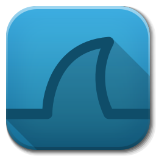

## Hello world , I'm [Sérgio Oliveira!](https://github.com/Mistakx/)

I'm a developer with a special interest in all kinds of malware, exploits, and cyber security in general.
<!--  -->

<!--  -->

### Personal information:
 
- 🛠 &nbsp; I’m currently working with Node.js and Golang.
- 📱 &nbsp; I'm currently working on a security related app for Android and iOS.
- 💻 &nbsp; My non hacking/malware related projects are available [here](https://github.com/Mistakx?tab=repositories).
- 📫 &nbsp; Reach me at: ade9@live.com.pt.

### Languages/Frameworks I love the most:

<code></code>
<code></code>
<code></code>
<code></code>
<code></code>

### Tools that I use on a daily basis:

<code></code>
<code></code>
<code></code>
<code></code>
<!-- "https://raw.githubusercontent.com/github/explore/80688e429a7d4ef2fca1e82350fe8e3517d3494d/topics/terminal/terminal.png" -->
